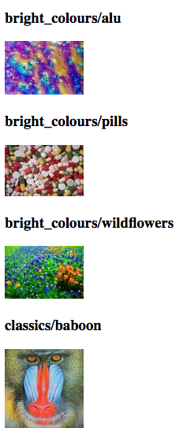
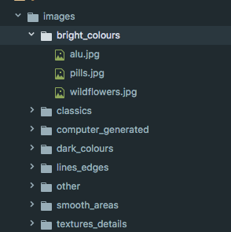
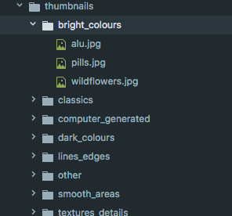

## Installing Apache-2 and PHP5

In order to install the required software, the Virtual Machine that was created needed to be able to access external resources located outside of the local cloud system used. This required the addition of a Proxy to bypass the fire-wall imposed by the current cloud architecture. 

In order to this, first, the `su` was used to become the root user, this enabled access to all command and files on the `ubuntu` operating system (1). Using this command, I also changed to the root directory which allowed me to access all of the base configuration files that would need to be modified to add the necessary proxy.

Once I gained access to the ubuntu commands, the `hosts` file needed to be modified, adding the name of my VM (Virtual Machine) to the top line, after doing this, the top line looked like this `Localhost 127.0.0.1 usyvm`, where `usyvm`. The `hosts` file was used to map the the VM name to the IP address preceding it. This ensured that when the domain name specified would be resolved to the localhost server (2).

Following this, the `apt` command needed to be configured. APT which refers to the Advanced Packaging Tool, is a package manager that ubuntu uses to download packages. When using `apt-get` followed by a package name, the tool will locate the package from online repositories and download it along with its dependencies, the steps taken in order to do this include the following (3).

- Dependency resolution
- Determining which packages needs to be downloaded
- Download the packages
- Install the necessary files

In order to enable the `apt` command to use the required transfer protocols, the proxy server needed to be added to the `/etc/apt/apt.conf.d/95proxies` file. This was used to enable different the following transfer protocols for the Keele proxy server.

- HTTP (HyperText Transfer Protocol)
- HTTPS (HyperText Transfer Protocol Secure)
- FTP (File Transfer Protocol)

Next, up the `/etc/environments` needed to be modified. This environments file allows you to set up system wide variables that enable the VM to direct traffic more easily, it is a configuration file, owned by root, therefore the `sudo` command needed to be used to make modifications. Most of the variables defined hold the hostname or ip addresses of the proxy server. Some of the variables created include, `http_proxy`, `https_proxy` and `ftp_proxy`. Once these are defined, the command line will have access to the url's defined by the variables.

All that was left to do, was to ensure that the environment variables were persistent and not reset. This was done by adding the variables to the `env_keep` variable located in `/etc/sudoers`, this file is referred to as the `default sudo security policy plugin` and is used for determining sudo privileges (5). This was needed since, sudo has a policy of resetting environment variables when the command is invoked (4).

After restarting the VM, the `apt` command was able to download the required packages. To test the proxy was configured, `curl http://google.com` was run in the terminal, this returned the requested data, which showed that the transfer protocols were working correctly. I then used the `apt-get` command to download both `php5` and the 'apache2' packages. 

To test if the apache server was successfully installed, I pointed the browser to the floating IP address attached to my VM 'TODO: add IP address', this brought up the default apache homepage.

    

In order to confirm PHP was installed, I added a simple script file `Mytest.php` to the 'var/www/html/' directory, which held the files for the apache server. This script contained the following code `<?php phpinfo(); ?>`. When accessing the file, via 'TODO: add IP address'/Mytest.php, the PHP configuration file was shown, suggesting that PHP was installed correctly.

    

## PHP Based Web Application

For the advanced task, an application to generate thumbnails from a given image database was created. To do this, I used PHP's `GD` package, which is built into the language, this meant that I didn't need use `Composer` or `Packagist`, which would have added external dependencies.

The GD package provides an abundance of methods that make working with image files a lot easier. All of the images from the database used the `jpg` format, which meant that the program didn't need to cater to multiple file extensions.

My approach to creating the program was to make two separate files, that served independent tasks. 

The first file named `thumbnail.php` contains a function that used the `GD` package to generate a thumbnail for a single image, taking in the location of the image as a parameter. Methods used from the package included the following.

- `imagecreatefromjpeg` - Used to create an image resource identifier, which stores information about the image being created. This information is used in further processing
- `imagesx` & `imagesy` - Used to obtain image width and height respectively
- `imagecreatetruecolor` - Used to create another image resource identifier, representing a black image of the sizes provided as parameters.
- `imagecopyresampled` - Used to copy the original image to the black image, transferring the pixels, without reducing clarity
- `imagejpeg` - Used to create the new thumbnail image file

The second file named `image_paths` contained methods that would extract the file paths of each and every image located in the images directory (where all of the images from the database were downloaded into).

After the two pieces of functionality were completed, I used a `main.php` script, to combine the two in a `foreach` loop, that took every image file path, and inserted it into the thumbnail generating function. All of the thumbnail images were then placed into a `thumbnail` directory, with the same directory structure as the `images` folder.

    
    

To display the fully working program, the `index.php` file holds the `HTML` output for each thumbnail image. All of which are prepended with the file name (including the collection that the image comes from).

    

